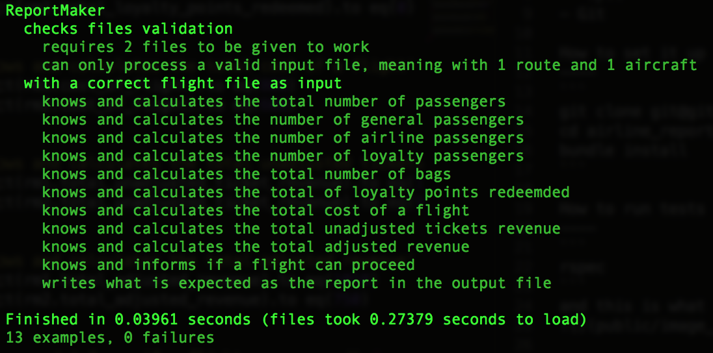

[](https://travis-ci.org/GBouffard/airline_report_maker) [](https://coveralls.io/github/GBouffard/airline_report_maker?branch=master) [](https://codeclimate.com/github/GBouffard/airline_report_maker)

:airplane: airline_reports_program :airplane:
===========
A small airline wants a simple program to be written that produces flight summary reports based on flight, route and passenger data. 

Technologies used
----
- Ruby
- Rspec
- Git

How to set it up
----
```
git clone git@github.com:GBouffard/airline_report_maker.git
cd airline_report_maker
bundle install
```

How to run tests
----
```
rspec
```
and this is what you should see


PS: as part of the test, running rspec creates 2 reports from the 2 files examples. They can be seen with
```
open 'report1.txt'
open 'report2.txt'
```

How to run the report maker in the console (irb)
----
```
irb
require './lib/report_maker.rb'
ReportMaker.new('flight1.txt', 'report1b.txt')
ReportMaker.new('flight2.txt', 'report2b.txt')
exit
open 'report1b.txt'
open 'report2b.txt'
```

What I learnt from this exercise
----
This is the first time I'm doing a project dealing with external files. I had to find new build-in methods for the program to work, which is great for my learning curve.